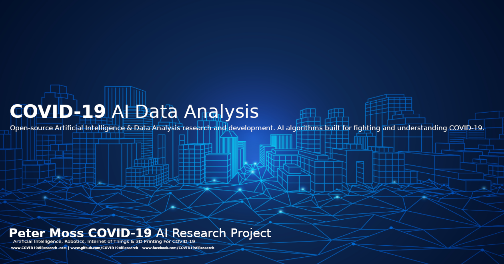

# Peter Moss COVID-19 AI Research Project

## COVID-19 AI Data Analysis

 

# Introduction
[COVID-19 AI Data Analysis](https://github.com/COVID-19-AI-Research-Project/COVID19-AI-Data-Analysis "COVID-19 AI Data Analysis") is a [Peter Moss COVID-19 AI Research Project](https://github.com/COVID-19-AI-Research-Project "Peter Moss COVID-19 AI Research Project") Artificial Intelligence & Data Analysis research & development project.

This repository will provide several projects created by our data scientists, projects will include installation scripts, documentation and code for AI algorithms built for fighting and understanding COVID-19.

The [Peter Moss COVID-19 AI Research Project](https://github.com/COVID-19-AI-Research-Project "Peter Moss COVID-19 AI Research Project") is a [Peter Moss Leukemia AI Research](https://github.com/COVID-19-AI-Research-Project "Peter Moss Leukemia AI Research") project. Our goal is to keep our research and technology open-source and free.

&nbsp;

# COVID-19 AI Data Analysis Installation
Please follow the [Installation Guide](Documentation/Installation/Installation.md "Installation Guide") to install COVID-19 AI Data Analysis.

&nbsp;

# COVID-19 AI Data Analysis Projects

Below are the current projects.

|ID | Project | Description | Author |
|---|---------|-------------|--------|
| 1 | [COVID-2020](Projects/1/ "COVID-2020") | COVID-2020. A data scientist perspective. This research shows that based on a population of 20,000,000 - 60,000,00, it will take roughly 1 year for the COVID-19 virus to curve off.  - Referenced in: [Covid-19 spread: Reproduction of data and prediction using a SIR model on Euclidean network](https://arxiv.org/pdf/2003.07063.pdf "Covid-19 spread: Reproduction of data and prediction using a SIR model on Euclidean network") by Kathakali Biswas, Abdul Khaleque, and Parongama Sen  - Leukemia AI Research Article: [COVID 2020 — A data scientist perspective](https://medium.com/leukemiaairesearch/covid-2020-a-data-scientist-perspective-c135c9e4e90d "COVID 2020 — A data scientist perspective") | [Dr Amita Kapoor](https://www.leukemiaresearchassociation.ai/team/amita-kapoor "Dr Amita Kapoor") |

&nbsp;

# Contributing

The [Peter Moss COVID-19 AI Research Project](https://github.com/COVID-19-AI-Research-Project "Peter Moss COVID-19 AI Research Project") encourages, and welcomes, code contributions, bug fixes and enhancements from the Github.

Please read the [CONTRIBUTING](CONTRIBUTING.md "CONTRIBUTING") document for a full guide to forking our repositories and submitting your pull requests. You will also find information about our code of conduct on this page.

## Contributors

- [Adam Milton-Barker](https://www.leukemiaresearchassociation.ai/team/adam-milton-barker "Adam Milton-Barker") - [Peter Moss Leukemia AI Research](https://www.leukemiaresearchassociation.ai "Peter Moss Leukemia AI Research") Founder & Intel Software Innovator, Sabadell, Spain

- [Dr Amita Kapoor](https://www.leukemiaresearchassociation.ai/team/amita-kapoor "Dr Amita Kapoor") - [Peter Moss Leukemia AI Research](https://www.leukemiaresearchassociation.ai "Peter Moss Leukemia AI Research") Student Program Team & R&D, Delhi, India

&nbsp;

# Versioning

We use SemVer for versioning. For the versions available, see [Releases](releases "Releases").

&nbsp;

# License

This project is licensed under the **MIT License** - see the [LICENSE](LICENSE "LICENSE") file for details.

&nbsp;

# Bugs/Issues

We use the [repo issues](issues "repo issues") to track bugs and general requests related to using this project. See [CONTRIBUTING](CONTRIBUTING.md "CONTRIBUTING") for more info on how to submit bugs, feature requests and proposals.